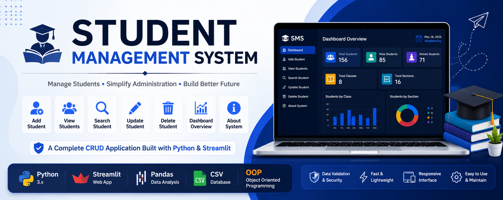
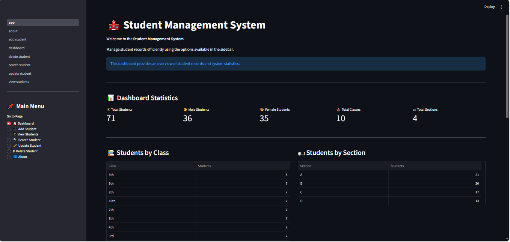
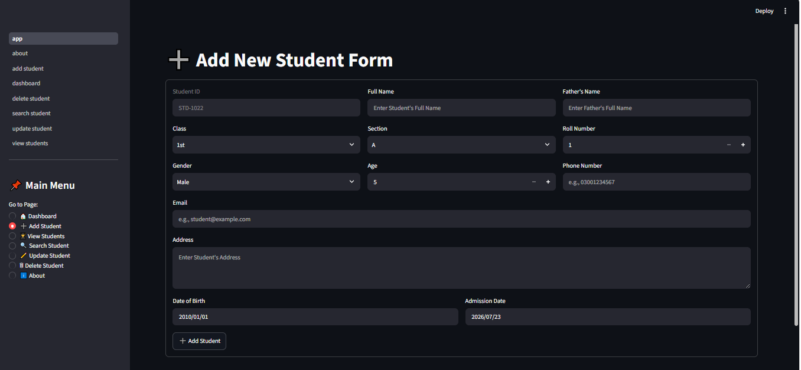
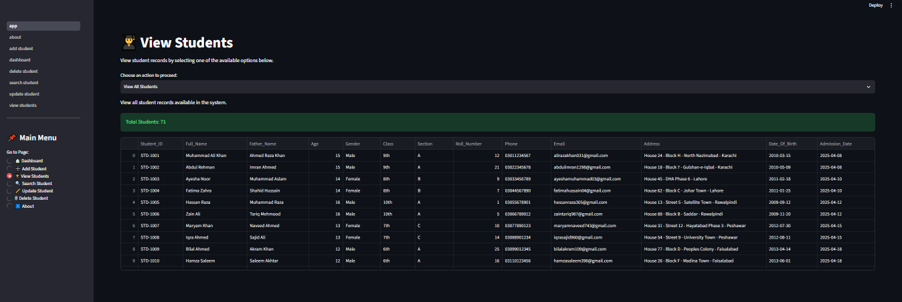
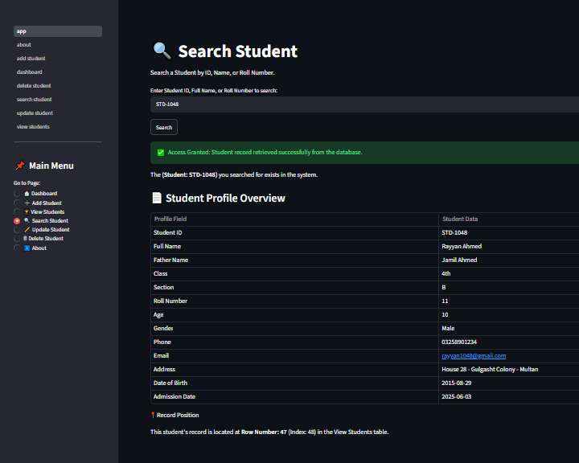
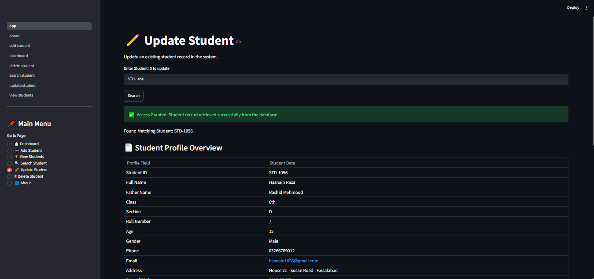
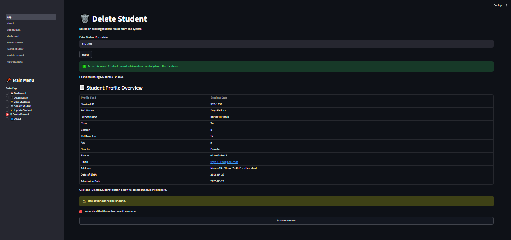
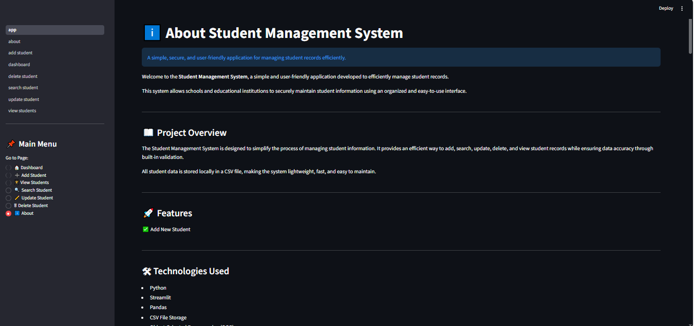

# 🎓 Student Management System

<p align="center">
  
</p>

<p align="center">


</p>

---

<p align="center">
  <a href="https://YOUR-STREAMLIT-APP-LINK.streamlit.app">
    
  </a>
</p>

---

# 📖 Project Overview

**Student Management System (SMS)** is a professional desktop web application developed using **Python, Streamlit, Pandas, and Object-Oriented Programming (OOP)**.

This system is designed to help schools, educational institutes, and administrators efficiently manage student records through a simple, user-friendly, and organized interface.

The application allows users to:

* Add new student records
* View all students
* Search student information
* Update student details
* Delete student records
* Generate automatic student IDs
* Validate data before saving
* Prevent duplicate student entries

All student information is stored in a structured CSV database, making the application lightweight, fast, and easy to maintain.

---

# 🎯 Project Objectives

The primary objective of this project is to provide a complete student record management solution that demonstrates:

* Python Programming
* Object-Oriented Programming (OOP)
* File Handling
* Data Management using Pandas
* Streamlit User Interface Development
* CRUD Operations
* Input Validation
* Real-World Project Structure

This project was developed as part of the learning journey in Artificial Intelligence & Data Science and serves as a portfolio-ready application.

---

# ✨ Key Features

## 🏠 Dashboard

The dashboard provides an overview of the entire system including:

* Total Students
* Male Students Count
* Female Students Count
* Total Classes
* Total Sections
* Student Statistics
* Class Summary
* Section Summary
* Current Date & Time
* Database Status Monitoring

---

## ➕ Add Student

Register new students into the system with complete validation.

### Features

* Automatic Student ID Generation
* Full Student Information Form
* Required Field Validation
* Phone Number Validation
* Email Validation
* Name Formatting
* Email Formatting
* Duplicate Roll Number Protection

---

## 👨‍🎓 View Students

Display student records in an organized table format.

### Available Options

* View All Students
* View Students by Class
* View Students by Section
* View Students by Class & Section
* Total Student Count Display

---

## 🔍 Search Student

Quickly search student information using:

* Student ID
* Full Name
* Roll Number

The system instantly retrieves matching records and displays complete student information.

---

## ✏️ Update Student

Modify existing student records with ease.

### Features

* Search by Student ID
* View Existing Information
* Update Student Details
* Validation Before Saving
* Duplicate Roll Number Protection

---

## 🗑️ Delete Student

Safely remove student records from the database.

### Features

* Student Search Before Deletion
* Student Profile Preview
* Confirmation Checkbox
* Permanent Record Removal

---

## ℹ️ About Page

Provides detailed information about:

* Project Overview
* Technologies Used
* Features
* Data Validation
* Project Information
* Developer Information

---

# 🛡️ Data Validation System

To maintain data quality and consistency, the system includes multiple validation checks.

### Validation Features

✔ Required Field Validation

✔ Student ID Validation

✔ Phone Number Validation

✔ Email Validation

✔ Duplicate Roll Number Prevention

✔ Automatic Name Formatting

✔ Automatic Email Formatting

✔ Data Consistency Checks

---

# 🚀 Technologies Used

| Technology   | Purpose                      |
| ------------ | ---------------------------- |
| Python       | Core Programming Language    |
| Streamlit    | Web Application Framework    |
| Pandas       | Data Processing & Management |
| CSV          | Database Storage             |
| OOP          | Application Structure        |
| OpenPyXL     | Excel Support                |
| Git & GitHub | Version Control              |

---

# 🖼️ Application Screenshots

## 🏠 Dashboard

<p align="center">
  
</p>

---

## ➕ Add Student

<p align="center">
  
</p>

---

## 👨‍🎓 View Students

<p align="center">
  
</p>

---

## 🔍 Search Student

<p align="center">
  
</p>

---

## ✏️ Update Student

<p align="center">
  
</p>

---

## 🗑️ Delete Student

<p align="center">
  
</p>

---

## ℹ️ About Page

<p align="center">
  
</p>

---


# 📌 Current Version

```text
Version: 1.0
Status : Active Development
Project Type : Student Management System
Database : CSV
Framework : Streamlit
```

---

# ⭐ Highlights

* Professional Folder Structure
* Clean User Interface
* CRUD Operations
* OOP-Based Design
* CSV Database Integration
* Student Data Validation
* Duplicate Protection
* Beginner-Friendly Architecture
* Portfolio Ready Project
* GitHub Ready Repository

---


# 📁 Project Folder Structure

```text
STUDENT-MANAGEMENT-SYSTEM/
│
├── assets/
│
├── data/
│   └── students.csv
│
├── pages/
│   ├── about.py
│   ├── add_student.py
│   ├── dashboard.py
│   ├── delete_student.py
│   ├── search_student.py
│   ├── update_student.py
│   └── view_student.py
│
├── reports/
│
├── screenshots/
│
├── app.py
├── student.py
├── utils.py
├── requirements.txt
├── README.md
└── .gitignore
```

---

# 📂 Folder Description

| Folder / File        | Description                                                                              |
| -------------------- | ---------------------------------------------------------------------------------------- |
| **assets/**          | Stores images, icons, logos, and other project assets.                                   |
| **data/**            | Contains the CSV database used to store student records.                                 |
| **pages/**           | Contains all Streamlit application pages.                                                |
| **reports/**         | Reserved for future report generation (PDF, Excel, etc.).                                |
| **screenshots/**     | Stores screenshots used inside the README.                                               |
| **app.py**           | Main entry point of the application.                                                     |
| **student.py**       | Defines the Student class using Object-Oriented Programming.                             |
| **utils.py**         | Contains helper functions for CRUD operations, validation, formatting, and CSV handling. |
| **requirements.txt** | Lists all required Python packages.                                                      |
| **README.md**        | Complete project documentation.                                                          |

---

# ⚙️ System Requirements

Before running the project, ensure your system meets the following requirements.

| Requirement      | Version                  |
| ---------------- | ------------------------ |
| Python           | 3.10 or Above            |
| Streamlit        | Latest Supported Version |
| Pandas           | Latest Supported Version |
| Operating System | Windows, Linux, macOS    |

---

# 📦 Installation Guide

## Step 1 — Clone the Repository

```bash
git clone https://github.com/your-username/student-management-system.git
```

---

## Step 2 — Move into the Project Folder

```bash
cd student-management-system
```

---

## Step 3 — Create a Virtual Environment

### Windows

```bash
python -m venv .venv
```

### Linux / macOS

```bash
python3 -m venv .venv
```

---

## Step 4 — Activate the Virtual Environment

### Windows

```bash
.venv\Scripts\activate
```

### Linux / macOS

```bash
source .venv/bin/activate
```

---

## Step 5 — Install Required Packages

```bash
pip install -r requirements.txt
```

---

## Step 6 — Run the Application

```bash
streamlit run app.py
```

---

# 🚀 How the Application Works

The workflow of the Student Management System is simple, organized, and efficient.

```text
User
   │
   ▼
Streamlit Interface
   │
   ▼
Input Validation
   │
   ▼
Student Object Creation
   │
   ▼
CRUD Operations
   │
   ▼
students.csv Database
   │
   ▼
Updated Records Display
```

---

# 🏗️ Project Architecture

```text
                  Student Management System

                           app.py
                              │
        ┌─────────────────────┼─────────────────────┐
        │                     │                     │
        ▼                     ▼                     ▼
 Dashboard Page         Student Pages        About Page
        │
        ▼
    utils.py
        │
        ▼
  Student Class (student.py)
        │
        ▼
 students.csv Database
```

---

# 📄 Application Pages

The application consists of multiple dedicated pages to make student management easy.

| Page                | Purpose                             |
| ------------------- | ----------------------------------- |
| 🏠 Dashboard        | Displays overall system statistics. |
| ➕ Add Student       | Registers a new student.            |
| 👨‍🎓 View Students | Displays all student records.       |
| 🔍 Search Student   | Searches student information.       |
| ✏️ Update Student   | Updates existing student records.   |
| 🗑️ Delete Student  | Removes student records.            |
| ℹ️ About            | Displays project information.       |

---

# 💾 Data Storage

The application stores all student records locally inside:

```text
data/students.csv
```

The CSV file automatically stores every student record entered through the application.

Whenever a student is:

* Added
* Updated
* Deleted

the CSV file is automatically updated without requiring any manual action.

---

# 📊 Student Database Fields

Each student record contains the following information.

| Field          | Description               |
| -------------- | ------------------------- |
| Student ID     | Unique Student Identifier |
| Full Name      | Student's Full Name       |
| Father's Name  | Father's Name             |
| Age            | Student Age               |
| Gender         | Male / Female             |
| Class          | Student Class             |
| Section        | Student Section           |
| Roll Number    | Class Roll Number         |
| Phone Number   | Student Contact Number    |
| Email          | Student Email Address     |
| Address        | Residential Address       |
| Date of Birth  | Student DOB               |
| Admission Date | Admission Date            |

---

# 🔄 CRUD Operations

The Student Management System supports complete CRUD functionality.

| Operation | Description                |
| --------- | -------------------------- |
| Create    | Add New Student            |
| Read      | View Student Records       |
| Update    | Modify Student Information |
| Delete    | Remove Student Records     |

All CRUD operations are performed using Python, Pandas, and CSV file storage.

---

# 📌 Core Functionalities

The project currently includes the following core modules.

* Dashboard Management
* Student Registration
* Student Record Viewing
* Student Search
* Student Information Update
* Student Record Deletion
* Automatic Student ID Generation
* Duplicate Roll Number Detection
* Phone Number Validation
* Email Validation
* Automatic Name Formatting
* Automatic Email Formatting
* CSV Data Management
* Object-Oriented Programming (OOP)
* Streamlit Web Interface

---


# 📄 Detailed Page Overview

## 🏠 Dashboard

The Dashboard provides a quick overview of the Student Management System.

### Features

* Total Students
* Male Students
* Female Students
* Total Classes
* Total Sections
* Students by Class
* Students by Section
* Current Date
* Current Time
* Database Status
* Quick Access Information
* Available Features Summary

---

## ➕ Add Student

The **Add Student** page allows administrators to register new students.

### Student Information Collected

* Student ID (Auto Generated)
* Full Name
* Father's Name
* Class
* Section
* Roll Number
* Gender
* Age
* Phone Number
* Email Address
* Residential Address
* Date of Birth
* Admission Date

### Built-in Validation

* Required Fields
* Phone Number Validation
* Email Validation
* Duplicate Roll Number Prevention (within the same Class & Section)
* Automatic Name Formatting
* Automatic Email Formatting

---

## 👨‍🎓 View Students

The View Students page allows users to browse stored student records.

### Available Options

* View All Students
* View Students by Class
* View Students by Class & Section
* Display Total Number of Students
* Responsive Data Table

---

## 🔍 Search Student

Search student records quickly using available search options.

### Supported Search

* Student ID
* Full Name
* Roll Number

After a successful search, the application displays the student's complete profile along with its position in the dataset.

---

## ✏️ Update Student

Update existing student records safely.

### Features

* Search Student by ID
* View Existing Information
* Modify Student Details
* Save Updated Information
* Prevent Duplicate Roll Numbers

---

## 🗑️ Delete Student

Delete student records securely.

### Features

* Search Student
* Display Complete Profile
* Confirmation Checkbox
* Permanent Record Deletion

---

## ℹ️ About

The About page provides information regarding:

* Project Overview
* Features
* Technologies Used
* Data Validation
* Project Information
* Developer Details

---

# 🔒 Validation Rules

The application performs several validation checks before saving or updating records.

| Validation            | Description                                                  |
| --------------------- | ------------------------------------------------------------ |
| Required Fields       | Empty fields are not allowed.                                |
| Student ID            | Automatically generated for every new student.               |
| Phone Number          | Must contain exactly 11 numeric digits.                      |
| Email Address         | Basic email format validation.                               |
| Duplicate Roll Number | Prevents duplicate roll numbers in the same Class & Section. |
| Name Formatting       | Automatically converts names to Title Case.                  |
| Email Formatting      | Automatically converts email addresses to lowercase.         |

---

# 📂 Database Information

Student records are stored locally in:

```text
data/students.csv
```

Each record includes:

* Student ID
* Full Name
* Father's Name
* Age
* Gender
* Class
* Section
* Roll Number
* Phone Number
* Email
* Address
* Date of Birth
* Admission Date

The application automatically updates this file whenever a student is added, updated, or deleted.

---

# 🧠 Object-Oriented Programming (OOP)

This project follows the principles of Object-Oriented Programming.

### Student Class

The `Student` class is responsible for representing student information and converting it into a structured dictionary format before storing it in the CSV database.

This makes the code cleaner, reusable, and easier to maintain.

---

# 📌 Current Project Status

| Module          | Status      |
| --------------- | ----------- |
| Dashboard       | ✅ Completed |
| Add Student     | ✅ Completed |
| View Students   | ✅ Completed |
| Search Student  | ✅ Completed |
| Update Student  | ✅ Completed |
| Delete Student  | ✅ Completed |
| About Page      | ✅ Completed |
| CSV Database    | ✅ Completed |
| CRUD Operations | ✅ Completed |

---

# 🚀 Future Improvements

The following features are planned for future versions of the project.

* SQLite / MySQL Database Integration
* User Authentication (Login System)
* Student Profile Photos
* Attendance Management
* Fee Management
* Teacher Management
* Subject Management
* Examination Module
* Result Management
* PDF Report Generation
* Excel Export
* Advanced Search & Filters
* Charts & Analytics
* Dark Mode
* Backup & Restore
* Cloud Database Integration
* Role-Based Access Control (Admin / Teacher)

---

# 🛠️ Development Notes

This project was developed to strengthen practical knowledge in:

* Python Programming
* Streamlit Development
* Pandas
* CSV File Handling
* Object-Oriented Programming (OOP)
* Data Validation
* CRUD Operations
* Real-World Project Development

---

# 🤝 Contributing

Contributions, suggestions, and improvements are always welcome.

If you would like to contribute:

1. Fork the repository.
2. Create a new feature branch.
3. Commit your changes.
4. Push the branch.
5. Open a Pull Request.

---

# 📝 License

This project is licensed under the **MIT License**.

See the [LICENSE](LICENSE) file for complete license details.

---

# 👨‍💻 Developer

**Muhammad Rasib Saeed**

AI & Data Science Student

Python Developer

Streamlit Developer

Karachi, Pakistan

---

# 📬 Contact

You can connect with me through the following platforms.

* GitHub: https://github.com/rasib-ai-dev
* LinkedIn: https://www.linkedin.com/in/muhammad-rasib-a6aba0413/
* Email: [pakcolony135@gmail.com](mailto:your-email@example.com)


---

# ⭐ Support the Project

If you found this project helpful, please consider giving it a ⭐ on GitHub.

Your support motivates further improvements and future open-source projects.

---

# 🙏 Acknowledgements

Special thanks to:

* Python Community
* Streamlit Community
* Pandas Developers
* Open Source Community
* Everyone who supported and inspired this learning journey

---

# 📈 Version History

| Version  | Description                                                            |
| -------- | ---------------------------------------------------------------------- |
| **v1.0** | Initial release with complete Student Management System functionality. |

---

# 📢 Disclaimer

This project is intended for educational, learning, and portfolio purposes.

Although the application demonstrates real-world CRUD operations and data management, it is not intended for production use without additional security, authentication, and database enhancements.

---

<div align="center">

## 🎓 Student Management System

**Built with ❤️ using Python, Streamlit & Pandas**

**Thank you for visiting this repository.**

⭐ **Don't forget to Star this repository if you like the project!** ⭐

</div>
